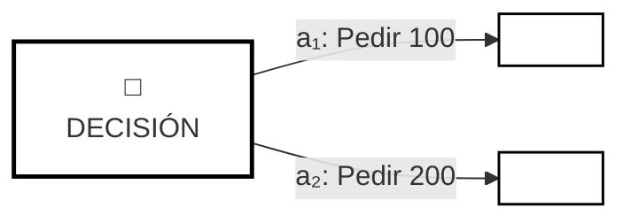
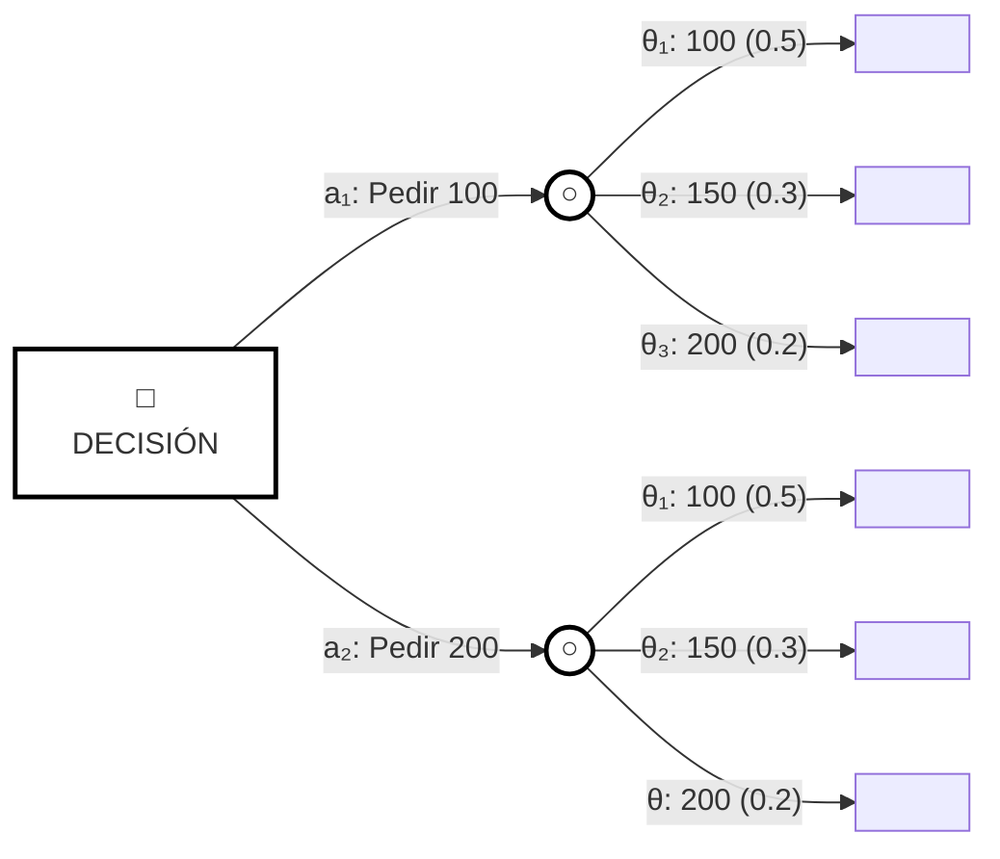
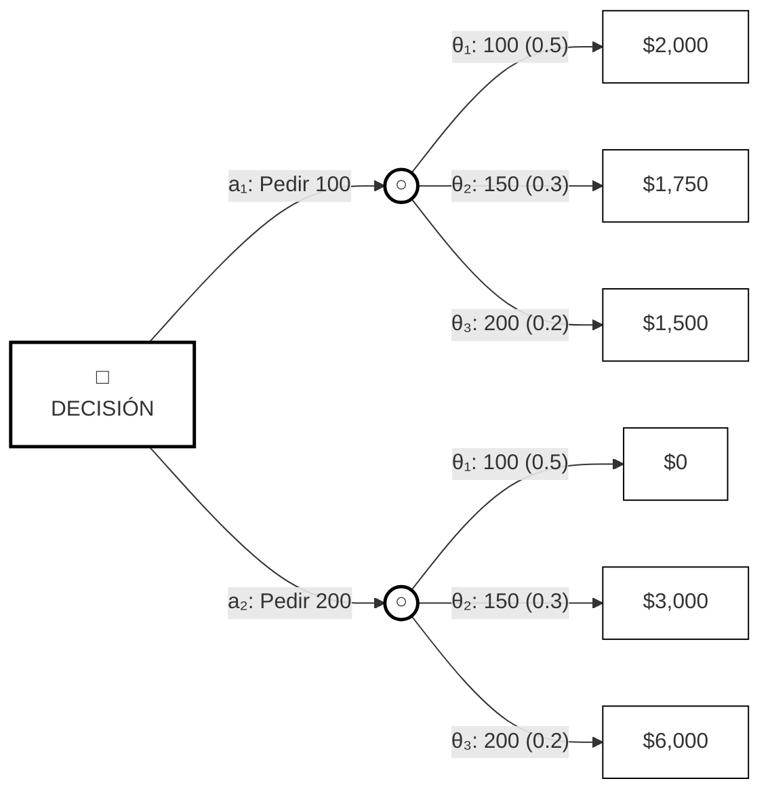
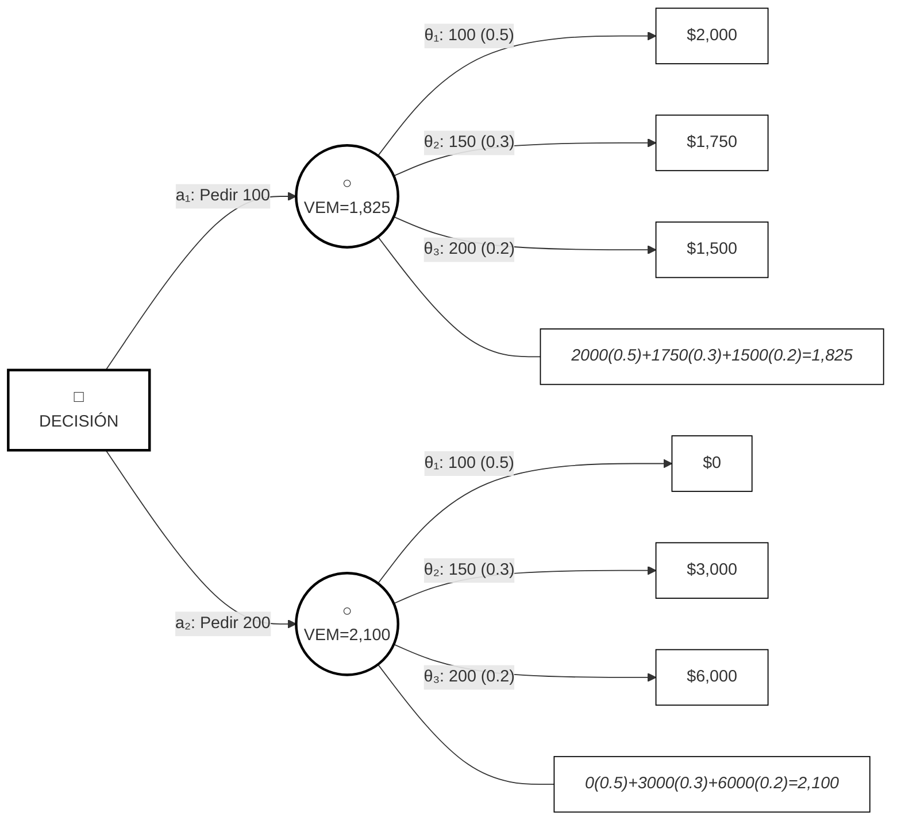
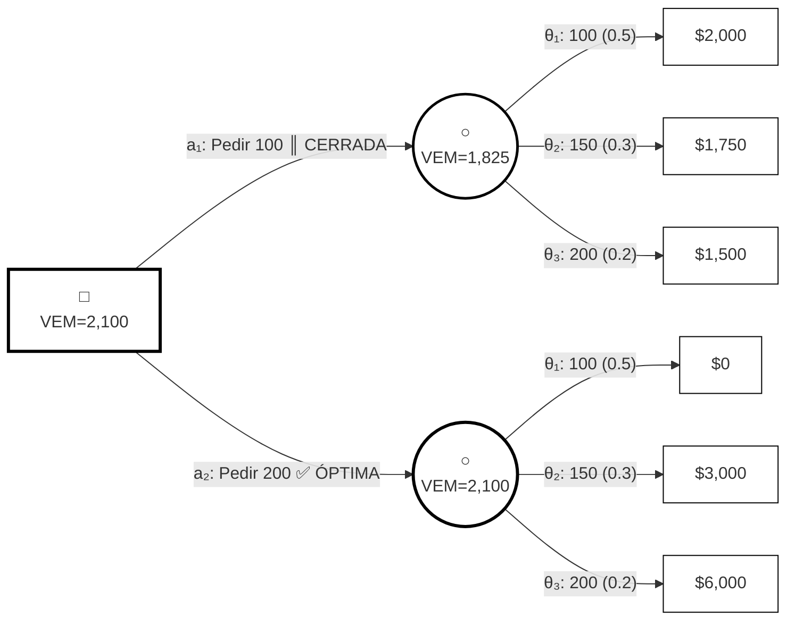
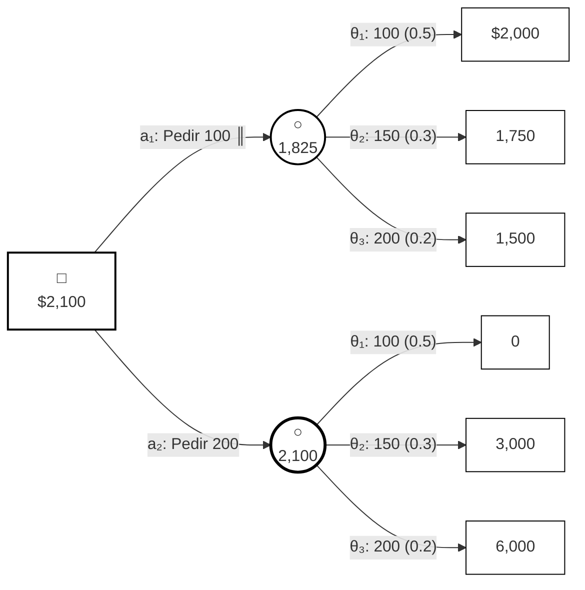

# Ejemplo 9 — Árbol de Decisión

El **Ejemplo 9** nos muestra cómo representar gráficamente la solución del **Ejemplo 4** usando un árbol de decisión. Este problema viene del **Ejemplo 1**, al que le fuimos agregando información: primero el planteamiento básico, luego las probabilidades de cada escenario de demanda.

---

## El Problema Original (Ejemplo 1)

Imagina que eres el dueño de una tienda de artículos deportivos. Cada enero tienes que hacer tu pedido de playeras de verano a tu proveedor. Las reglas del juego son:

- Los pedidos son en lotes de 100 prendas
- El precio por prenda depende de cuánto pidas:
  - 100 playeras: $100 cada una
  - 200 playeras: $90 cada una
  - 300 o más: $85 cada una
- Las vendes al público a $120 cada una
- Lo que no vendas al final del verano, lo rematas a mitad de precio ($60)
- Si un cliente quiere una playera y no tienes, pierdes $5 de tu reputación

Tú crees que la demanda será de 100, 150 o 200 prendas. El problema es que tienes que hacer el pedido de una sola vez, sin saber exactamente cuántas venderás.

## Agregando Probabilidades (Ejemplo 4)

Ahora supongamos que tienes más información. Estimamos que:
- Hay 50% de probabilidad de que la demanda sea de 100 playeras
- 30% de probabilidad de que sea de 150 playeras
- 20% de probabilidad de que sea de 200 playeras

Con esta información, podemos tomar una decisión más informada.

## Resolviendo el Problema (Ejemplo 9)

### Paso 1: Identificar quién decide

Tú, el propietario de la tienda, eres el decisor. Tu objetivo es maximizar tu ganancia.

### Paso 2: Definir tus opciones

Tienes dos opciones viables:
- **$a_1$**: Pedir 100 playeras
- **$a_2$**: Pedir 200 playeras

¿Por qué no consideramos pedir 300? Porque esa opción está **dominada** por pedir 200. Esto significa que pedir 200 siempre te da mejores resultados que pedir 300, sin importar cuánta demanda haya. Así que la descartamos desde el inicio.

### Paso 3: Identificar los escenarios posibles

La naturaleza (la demanda del mercado) puede presentarse de tres formas:

| Escenario | Demanda | Probabilidad |
|-----------|---------|--------------|
| $\theta_1$ | 100 playeras | 50% |
| $\theta_2$ | 150 playeras | 30% |
| $\theta_3$ | 200 playeras | 20% |

### Paso 4: Calcular cuánto ganarías en cada caso

Aquí viene la parte interesante. Vamos a calcular tu ganancia para cada combinación de decisión y escenario:

**Si pides 100 playeras ($a_1$):**
- Si la demanda es 100: Vendes todas a $20 de ganancia cada una = $2,000
- Si la demanda es 150: Vendes 100 a $20 de ganancia, pero pierdes $5 por cada una de las 50 que no puedes entregar = $1,750
- Si la demanda es 200: Vendes 100 a $20 de ganancia, pero pierdes $5 por cada una de las 100 que no puedes entregar = $1,500

**Si pides 200 playeras ($a_2$):**
- Si la demanda es 100: Vendes 100 a $30 de ganancia, pero rematas 100 a $30 de pérdida = $0
- Si la demanda es 150: Vendes 150 a $30 de ganancia, rematas 50 a $30 de pérdida = $3,000
- Si la demanda es 200: Vendes todas a $30 de ganancia = $6,000

Esto nos da la siguiente matriz de pagos (en miles de pesos):

| Escenario \ Decisión | Pedir 100 | Pedir 200 |
|---------------------|-----------|-----------|
| Demanda 100 (50%) | $2,000 | $0 |
| Demanda 150 (30%) | $1,750 | $3,000 |
| Demanda 200 (20%) | $1,500 | $6,000 |

### Paso 5: Calcular el Valor Esperado Monetario (VEM)

Ahora multiplicamos cada ganancia por su probabilidad y sumamos:

**Para pedir 100 playeras:**
$$VEM(a_1) = 2000(0.5) + 1750(0.3) + 1500(0.2) = 1000 + 525 + 300 = \$1,825$$

**Para pedir 200 playeras:**
$$VEM(a_2) = 0(0.5) + 3000(0.3) + 6000(0.2) = 0 + 900 + 1200 = \$2,100$$

Comparando: $\max\{1825, 2100\} = 2100$

**La mejor decisión es pedir 200 playeras**, con una ganancia esperada de $2,100.

### Paso 6: Representarlo como Árbol de Decisión

Un árbol de decisión nos permite visualizar todo el proceso de manera gráfica. Funciona así:

```
                        Acción              Estado (Demanda)        Pagos
                                                           
                                                      θ₁: 100 (0.5) ───── $200
                                                     ╱
                                                    ╱  θ₂: 150 (0.3) ───── 175
                                                   ╱
                                                  ╱   θ₃: 200 (0.2) ───── 150
                                                 ╱
                    ──────── a₁: Pedir 100 ────○ (182.5)
                    │         ║ (cerrada)
                    │
        □ ──────────
       $210         │
                    │         ┌──────── θ₁: 100 (0.5) ───── 0
                    │         │
                    ──────── a₂: Pedir 200 ───○ (210) ─── θ₂: 150 (0.3) ───── 300
                                                  │
                                                  └──────── θ₃: 200 (0.2) ───── 600
```

**¿Cómo leer este árbol?**

Los símbolos tienen significados específicos:
- **Cuadrado (□)**: Es un nodo de decisión. Aquí tú eliges qué hacer.
- **Círculo (○)**: Es un nodo de probabilidad. Aquí la naturaleza decide qué escenario ocurre.
- **Doble línea (║)**: Indica una rama cerrada, es decir, una opción que descartamos porque no es la mejor.
- **Los números en los nodos**: Son los valores esperados de cada decisión.

**El proceso de resolución (inducción regresiva):**

Resolvemos el árbol "hacia atrás", desde los extremos hacia la raíz:

1. **Primero anotamos los pagos finales** al final de cada rama (los valores de la matriz de pagos).

2. **Luego calculamos el valor esperado de cada nodo de probabilidad**:
   - Para el nodo de $a_1$: $2000(0.5) + 1750(0.3) + 1500(0.2) = 182.5$ (en miles)
   - Para el nodo de $a_2$: $0(0.5) + 3000(0.3) + 6000(0.2) = 210$ (en miles)

3. **En el nodo de decisión**, comparamos los valores esperados:
   - $\max\{182.5, 210\} = 210$
   - Elegimos $a_2$ (pedir 200 playeras)

4. **Cerramos la rama no óptima** ($a_1$) con una doble línea, indicando que la descartamos.

# Árbol de Decisión del Ejemplo 9 — Construcción Paso a Paso

A continuación presento una serie de diagramas Mermaid que ilustran la construcción progresiva del árbol de decisión, desde la estructura básica hasta la solución final mediante inducción regresiva.

## Paso 1: Nodo de Decisión Raíz y Acciones Disponibles

En este primer paso, establecemos el punto de partida: el decisor (propietario de la tienda) frente a sus dos opciones viables.



**Interpretación:** El cuadrado representa al decisor. De él parten dos ramas, una por cada acción disponible.

## Paso 2: Agregar los Nodos de Probabilidad (Estados de la Naturaleza)

Cada acción conduce a un nodo de azar donde la naturaleza "decide" qué demanda se presentará. Las tres posibilidades son: $\theta_1$ (demanda 100), $\theta_2$ (demanda 150) y $\theta_3$ (demanda 200).



**Interpretación:** Los círculos representan nodos de probabilidad. De cada uno parten tres ramas, una por cada estado de la naturaleza, etiquetadas con su probabilidad.

## Paso 3: Asignar los Pagos Finales en los Extremos

Ahora colocamos las consecuencias monetarias (en miles de pesos) al final de cada rama, según la matriz de pagos calculada.



**Interpretación:** Cada extremo del árbol muestra la ganancia (o pérdida) que resultaría de esa combinación específica de acción y estado de la naturaleza.

## Paso 4: Calcular el VEM en cada Nodo de Probabilidad (Inducción Regresiva)

Aplicamos la inducción regresiva: calculamos el valor esperado de cada nodo de azar multiplicando cada pago por su probabilidad y sumando.



**Cálculos detallados:**

- **Nodo $a_1$:** $VEM = 2000(0.5) + 1750(0.3) + 1500(0.2) = 1000 + 525 + 300 = \$1,825$
- **Nodo $a_2$:** $VEM = 0(0.5) + 3000(0.3) + 6000(0.2) = 0 + 900 + 1200 = \$2,100$

## Paso 5: Decisión Final y Cierre de Rama No Óptima

En el nodo de decisión raíz, comparamos los VEM de ambas acciones y seleccionamos el máximo. La rama no óptima se cierra con doble línea.



**Decisión:** $\max\{1825, 2100\} = 2100 \implies a_2$ (Pedir 200 playeras)

## Diagrama Final Completo

Versión final con estilo minimalista, solo contornos, siguiendo la convención de la autora:



## Resumen del Proceso de Inducción Regresiva

| Paso | Acción | Resultado |
|:---:|:---|:---|
| 1 | Identificar nodo de decisión y acciones | □ con ramas $a_1$ y $a_2$ |
| 2 | Agregar nodos de probabilidad | ○ con ramas $\theta_1, \theta_2, \theta_3$ |
| 3 | Asignar pagos finales | Valores en extremos del árbol |
| 4 | Calcular VEM en nodos de azar | $VEM(a_1)=1,825$; $VEM(a_2)=2,100$ |
| 5 | Seleccion máximo en nodo de decisión | $\max\{1825, 2100\} = 2100$ |
| 6 | Cerrar rama no óptima | $a_1$ marcada con doble línea |

**Decisión óptima:** Pedir 200 playeras ($a_2$), con VEM = **$2,100** (miles de pesos).

## Conclusión

La decisión óptima es **pedir 200 playeras**, lo que te dará una ganancia esperada de **$2,100** (miles de pesos). 

Aunque pedir 100 playeras parece más seguro (siempre ganas algo), el análisis muestra que pedir 200 playeras maximiza tu ganancia esperada cuando consideras las probabilidades de cada escenario de demanda. El riesgo de tener que rematar algunas playeras se compensa con la oportunidad de ganar mucho más si la demanda es alta.
