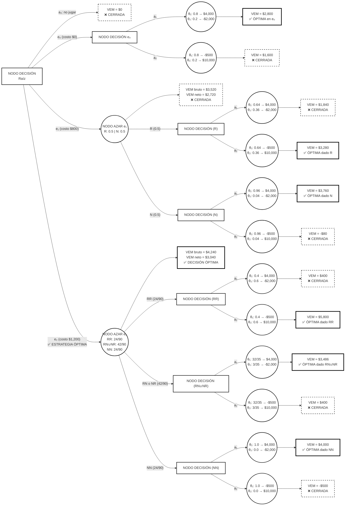

### Lección de Estudio: Toma de Decisiones con Experimentación
### Sección 3.5 — Guía Didáctica

---

### Parte I: Fundamentos Conceptuales

#### 1. ¿Qué vamos a aprender?

Al terminar esta lección, vas a poder:

1. **Entender la diferencia** entre decidir con lo que sabes (análisis *a priori*) y decidir después de experimentar (análisis *a posteriori*).  
2. **Usar el Teorema de Bayes** para actualizar tus creencias cuando obtienes nueva información.  
3. **Construir y resolver árboles de decisión** con varias etapas usando inducción regresiva.  
4. **Calcular e interpretar** el Valor Esperado de la Información Perfecta (VEIP) y el Valor Esperado de la Información de la Muestra (VEIM).  
5. **Tomar decisiones óptimas** comparando el valor de la información contra lo que cuesta obtenerla.  

#### 2. El dilema de la información

##### 2.1. Una pregunta que parece simple pero no lo es

Imagina que estás por tomar una decisión importante bajo incertidumbre. Alguien te ofrece más información, pero tiene un precio. Tu primera reacción probablemente sea: "¡Claro que vale la pena! Más información siempre es mejor, ¿no?"

Pues no tan rápido. Aquí está la paradoja:

**¿Vale la pena pagar por obtener más información?**

Suena obvio que sí, pero pensemos en términos económicos. La información tiene un **costo** (experimentación, muestreo, análisis) y un **beneficio** (mejores decisiones). Solo cuando el beneficio de esa información supera lo que cuesta obtenerla, tiene sentido pagar por ella.

##### 2.2. Los tres niveles de información

| Tipo de información | ¿Qué es? | ¿Cuánto vale? |
| :--- | :--- | :--- |
| **Información perfecta** | Te dice con 100% de certeza qué va a pasar antes de que decidas. | El máximo posible (VEIP) |
| **Información muestral** | Te da pistas parciales mediante experimentos o muestras. | Intermedio (VEIM) |
| **Información** ***a priori*** | Lo que crees saber antes de hacer cualquier experimento. | Tu punto de partida |

##### 2.3. La regla de oro del valor informativo

Existe una relación fundamental que siempre se cumple:

$$\text{VEIP} \geq \text{VEIM} \geq 0$$

**¿Por qué?** La información perfecta es, por definición, la mejor información que puedes tener. Cualquier información muestral es imperfecta, así que vale menos. Y si no haces ningún experimento (solo usas tu información *a priori*), el valor de la información muestral es cero.

#### 3. Las herramientas del análisis *a posteriori*

##### 3.1. ¿Qué es el análisis *a posteriori*?

El **análisis *a posteriori*** es simplemente el proceso de calcular el Valor Esperado Monetario (VEM) usando **probabilidades actualizadas** (*a posteriori*) que incorporan la información que obtuviste de un experimento o muestra.

La palabra "*posteriori*" significa "después de la experiencia". Así que las probabilidades *a posteriori* son las que calculas *después* de ver los resultados de tu experimento, es decir, después de hacer un experimento estadístico.

##### 3.2. El Teorema de Bayes: tu mejor amigo

El Teorema de Bayes es la herramienta matemática que te permite actualizar tus creencias cuando obtienes nueva evidencia:

$$P(\theta_i \mid E) = \frac{P(E \mid \theta_i) \cdot P(\theta_i)}{P(E)}$$

Desglosemos esto:
- $P(\theta_i \mid E)$ = probabilidad *a posteriori*: ¿qué tan probable es el estado $\theta_i$ dado que observé el resultado $E$?  
- $P(E \mid \theta_i)$ = verosimilitud: ¿qué tan probable es observar $E$ si el estado es $\theta_i$?  
- $P(\theta_i)$ = probabilidad *a priori*: ¿qué tan probable era $\theta_i$ antes del experimento?  
- $P(E)$ = probabilidad marginal: ¿qué tan probable es observar $E$ en general?  

El denominador $P(E)$ se calcula así:

$$P(E) = \sum_{i=1}^{n} P(E \mid \theta_i) \cdot P(\theta_i)$$

**En palabras simples:** $P(E)$ es la probabilidad total de observar el resultado experimental, considerando todos los estados posibles. Es el "factor de normalización" que asegura que tus probabilidades *a posteriori* sumen 1.

##### 3.3. Los conceptos clave que necesitas dominar

| Concepto | ¿Cómo se calcula? | ¿Qué significa en la práctica? |
| :--- | :--- | :--- |
| **VEIP *a posteriori*** | $VEC - VEM_{\max}$ (con probabilidades revisadas) | Lo máximo que pagarías por información perfecta *después* del experimento |
| **VEIM** | $VEM_{\text{con experimentación}} - VEM_{\text{sin experimentación}}$ | El beneficio bruto de hacer el experimento |
| **VEM neto** | $VEM_{\text{con experimentación}} - \text{Costo del experimento}$ | El beneficio real después de pagar el experimento |
| **POE** | $VEC - VEM$ | El costo de la incertidumbre; es igual al VEIP |

##### 3.4. La relación fundamental (tu cheque de calidad)

En todo nodo de decisión se cumple esta identidad:

$$VEM(a_j) + POE(a_j) = VEC$$

donde $VEC$ es el **Valor Esperado bajo Certeza** para las probabilidades vigentes en ese nodo.

**¿Por qué es útil?** Esta relación te permite verificar que tus cálculos estén bien. Si no se cumple en algún nodo, hay un error en algún lado. Es como una prueba de consistencia.

---

### Parte II: El Ejemplo Integrador

#### 4. Planteamiento del problema

##### 4.1. El escenario

**Ejemplo 11.** Imagina que tienes frente a ti 1,000 urnas de dos tipos:
- Tipo $\theta_1$: contiene 4 bolas rojas y 6 bolas negras  
- Tipo $\theta_2$: contiene 9 bolas rojas y 1 bola negra  

De las 1,000 urnas, 800 son del tipo $\theta_1$ y 200 son del tipo $\theta_2$.

Alguien selecciona una urna al azar, le quita la etiqueta y la pone frente a ti. Tu tarea es adivinar qué tipo de urna es. Los pagos son:
- Si dices que es $\theta_1$ y aciertas: ganas \$4,000  
- Si dices que es $\theta_1$ y fallas: pierdes \$2,000  
- Si dices que es $\theta_2$ y aciertas: ganas \$10,000  
- Si dices que es $\theta_2$ y fallas: pierdes \$500  

Puedes pagar para hacer experimentos y obtener más información:
- $e_0$: decidir con la información que ya tienes (costo: \$0)  
- $e_1$: pagar \$800 y extraer una bola de la urna  
- $e_2$: pagar \$1,200 y extraer dos bolas de la urna  

##### 4.2. Organicemos la información

| Elemento | ¿Qué es? | ¿Por qué importa? |
| :--- | :--- | :--- |
| **Decisor** | Tú, el participante del juego | Quien toma la decisión final |
| **Acciones** | $a_1$: decir $\theta_1$; $a_2$: decir $\theta_2$; $a_3$: no jugar | Las opciones que tienes |
| **Estados** | $\theta_1$: urna tipo 1; $\theta_2$: urna tipo 2 | La realidad que no conoces |
| **Probabilidades *a priori*** | $P(\theta_1) = 0.8$; $P(\theta_2) = 0.2$ | Basadas en la composición del conjunto |
| **Composición** | $\theta_1$: 4R, 6N; $\theta_2$: 9R, 1N | Información estructural clave |

##### 4.3. Construyamos la matriz de pagos

Pensemos paso a paso en cada escenario:

1. **Si eliges $a_1$ (decir $\theta_1$):**
   - Si la urna es realmente $\theta_1$: aciertas → ganas \$4,000  
   - Si la urna es realmente $\theta_2$: fallas → pierdes \$2,000  

2. **Si eliges $a_2$ (decir $\theta_2$):**
   - Si la urna es realmente $\theta_1$: fallas → pierdes \$500  
   - Si la urna es realmente $\theta_2$: aciertas → ganas \$10,000  

3. **Si eliges $a_3$ (no jugar):**
   - Sin importar el estado: no ganas ni pierdes nada (\$0)  

**Matriz de consecuencias:**

| $\theta_i$ | $a_1$ (decir $\theta_1$) | $a_2$ (decir $\theta_2$) | $a_3$ (no jugar) | $P(\theta_i)$ |
| :---: | :---: | :---: | :---: | :---: |
| $\theta_1$ | +4,000 | -500 | 0 | 0.8 |
| $\theta_2$ | -2,000 | +10,000 | 0 | 0.2 |

**Diagrama de arbol**

### Parte III: Análisis de la Rama $e_0$ (Sin Experimentación)

#### 5. Decidir con lo que ya sabes

##### 5.1. Calculando el VEM de cada acción

**Para $a_1$:**
$$VEM(a_1) = 4000 \cdot P(\theta_1) + (-2000) \cdot P(\theta_2)$$
$$VEM(a_1) = 4000(0.8) + (-2000)(0.2)$$
$$VEM(a_1) = 3200 - 400 = \$2,800$$

**Para $a_2$:**
$$VEM(a_2) = (-500) \cdot P(\theta_1) + 10000 \cdot P(\theta_2)$$
$$VEM(a_2) = (-500)(0.8) + 10000(0.2)$$
$$VEM(a_2) = -400 + 2000 = \$1,600$$

**Para $a_3$:**
$$VEM(a_3) = 0$$

##### 5.2. ¿Qué decides?

$$\max\{VEM(a_1), VEM(a_2), VEM(a_3)\} = \max\{2800, 1600, 0\} = 2800$$

**Decisión:** $a_1$ (decir que la urna es del tipo $\theta_1$)

**¿Por qué?** Sin información adicional, la probabilidad *a priori* favorece ampliamente a $\theta_1$ (80%), así que la decisión racional es apostar por este estado.

##### 5.3. ¿Cuánto vale la información perfecta?

**Paso 1: Calcular el Valor Esperado bajo Certeza (VEC)**

Si supieras con certeza el tipo de urna:
- Si $\theta_1$ ocurre (prob. 0.8): elegirías $a_1$ y ganarías \$4,000  
- Si $\theta_2$ ocurre (prob. 0.2): elegirías $a_2$ y ganarías \$10,000  

$$VEC = 4000(0.8) + 10000(0.2) = 3200 + 2000 = \$5,200$$

**Paso 2: Calcular el VEIP**

$$VEIP = VEC - VEM_{\max} = 5200 - 2800 = \$2,400$$

**Interpretación:** Lo máximo que deberías pagar por conocer con certeza el tipo de urna antes de decidir es \$2,400.

##### 5.4. Verifiquemos con la matriz de pérdida de oportunidad

**Construyamos la matriz de arrepentimiento:**

Para cada estado, calculemos cuánto "lamentarías" no haber elegido la mejor acción:

- **Si $\theta_1$ ocurre:**  
  - Mejor acción: $a_1$ (gana \$4,000)  
  - Arrepentimiento de $a_1$: $4000 - 4000 = 0$  
  - Arrepentimiento de $a_2$: $4000 - (-500) = 4500$  

- **Si $\theta_2$ ocurre:**  
  - Mejor acción: $a_2$ (gana \$10,000)  
  - Arrepentimiento de $a_1$: $10000 - (-2000) = 12000$  
  - Arrepentimiento de $a_2$: $10000 - 10000 = 0$  

**Matriz de pérdida de oportunidad:**

| $\theta_i$ | $a_1$ | $a_2$ | $P(\theta_i)$ |
| :---: | :---: | :---: | :---: |
| $\theta_1$ | 0 | 4,500 | 0.8 |
| $\theta_2$ | 12,000 | 0 | 0.2 |
| **POE** | **2,400** | **3,600** | |

**Cálculo de la POE:**

$$POE(a_1) = 0(0.8) + 12000(0.2) = 2400$$
$$POE(a_2) = 4500(0.8) + 0(0.2) = 3600$$

**Verifiquemos la relación fundamental:**

$$VEM(a_1) + POE(a_1) = 2800 + 2400 = 5200 = VEC \quad \checkmark$$
$$VEM(a_2) + POE(a_2) = 1600 + 3600 = 5200 = VEC \quad \checkmark$$

**Conclusión:** $POE(a_1) = VEIP = \$2,400$. La acción óptima es la que minimiza la pérdida de oportunidad esperada.

### Parte IV: Análisis de la Rama $e_1$ (Extracción de Una Bola)

#### 6. El experimento de una extracción

##### 6.1. ¿Cómo funciona?

Pagas \$800, extraes **una bola** de la urna y observas su color. Los resultados posibles son:
- **R**: bola roja  
- **N**: bola negra  

##### 6.2. Probabilidades condicionales (verosimilitudes)

**Para $\theta_1$ (4 rojas, 6 negras de 10 totales):**
$$P(R \mid \theta_1) = \frac{4}{10} = 0.4$$
$$P(N \mid \theta_1) = \frac{6}{10} = 0.6$$

**Para $\theta_2$ (9 rojas, 1 negra de 10 totales):**
$$P(R \mid \theta_2) = \frac{9}{10} = 0.9$$
$$P(N \mid \theta_2) = \frac{1}{10} = 0.1$$

**Observa esto:** Las urnas $\theta_2$ tienen proporcionalmente más bolas rojas (90%) que las urnas $\theta_1$ (40%). Por tanto, si ves una bola roja, eso es evidencia a favor de $\theta_2$.

##### 6.3. Probabilidades marginales de los resultados

**Probabilidad de observar una bola roja:**

$$P(R) = P(R \mid \theta_1)P(\theta_1) + P(R \mid \theta_2)P(\theta_2)$$
$$P(R) = (0.4)(0.8) + (0.9)(0.2)$$
$$P(R) = 0.32 + 0.18 = 0.50$$

**Probabilidad de observar una bola negra:**

$$P(N) = P(N \mid \theta_1)P(\theta_1) + P(N \mid \theta_2)P(\theta_2)$$
$$P(N) = (0.6)(0.8) + (0.1)(0.2)$$
$$P(N) = 0.48 + 0.02 = 0.50$$

**Verificación:** $P(R) + P(N) = 0.50 + 0.50 = 1$ ✓

**Dato interesante:** Ambas probabilidades son iguales (50%). Esto significa que, en promedio, es igualmente probable extraer una bola roja o negra del conjunto de urnas.

##### 6.4. Actualicemos las probabilidades (Teorema de Bayes)

**Caso 1: Si la bola extraída es ROJA (R)**

Aplicamos el Teorema de Bayes:

$$P(\theta_1 \mid R) = \frac{P(R \mid \theta_1)P(\theta_1)}{P(R)} = \frac{(0.4)(0.8)}{0.5} = \frac{0.32}{0.5} = 0.64$$

$$P(\theta_2 \mid R) = 1 - P(\theta_1 \mid R) = 1 - 0.64 = 0.36$$

**¿Qué cambió?**
- Probabilidad *a priori* de $\theta_1$: 0.80  
- Probabilidad *a posteriori* de $\theta_1$: 0.64  
- **Cambio:** disminución de 0.16  

**Interpretación:** Al observar una bola roja, la probabilidad de que la urna sea $\theta_1$ disminuye, porque las urnas $\theta_2$ tienen más bolas rojas. La evidencia empírica "desplaza" tu creencia hacia $\theta_2$.

**Caso 2: Si la bola extraída es NEGRA (N)**

$$P(\theta_1 \mid N) = \frac{P(N \mid \theta_1)P(\theta_1)}{P(N)} = \frac{(0.6)(0.8)}{0.5} = \frac{0.48}{0.5} = 0.96$$

$$P(\theta_2 \mid N) = 1 - P(\theta_1 \mid N) = 1 - 0.96 = 0.04$$

**¿Qué cambió?**
- Probabilidad *a priori* de $\theta_1$: 0.80  
- Probabilidad *a posteriori* de $\theta_1$: 0.96  
- **Cambio:** aumento de 0.16  

**Interpretación:** Al observar una bola negra, la probabilidad de $\theta_1$ aumenta significativamente, confirmando tu creencia inicial. Las urnas $\theta_1$ tienen más bolas negras (60%) que las $\theta_2$ (10%).

##### 6.5. ¿Qué decides si la bola es ROJA?

**Calculemos el VEM con las probabilidades actualizadas:**

$$VEM(a_1 \mid R) = 4000(0.64) + (-2000)(0.36) = 2560 - 720 = \$1,840$$

$$VEM(a_2 \mid R) = (-500)(0.64) + 10000(0.36) = -320 + 3600 = \$3,280$$

**Decisión óptima si R:** $\max\{1840, 3280\} = 3280 \implies a_2$

**¡Momento crucial!** Sin experimentación, tu decisión óptima era $a_1$. Pero al observar una bola roja, la decisión óptima cambia a $a_2$. La evidencia empírica **invirtió** tu decisión.

**Matriz de pérdida de oportunidad (dado R):**

| $\theta_i$ | $a_1$ | $a_2$ | $P(\theta_i \mid R)$ |
| :---: | :---: | :---: | :---: |
| $\theta_1$ | 0 | 4,500 | 0.64 |
| $\theta_2$ | 12,000 | 0 | 0.36 |
| **POE** | **4,320** | **2,880** | |

**Cálculo del VEIP dado R:**

$$VEIP \mid R = \min\{POE(a_1), POE(a_2)\} = \min\{4320, 2880\} = \$2,880$$

**Verifiquemos la relación fundamental:**

$$VEC \mid R = 4000(0.64) + 10000(0.36) = 2560 + 3600 = 6160$$
$$VEM(a_1 \mid R) + POE(a_1 \mid R) = 1840 + 4320 = 6160 \quad \checkmark$$
$$VEM(a_2 \mid R) + POE(a_2 \mid R) = 3280 + 2880 = 6160 \quad \checkmark$$

**Reflexión importante:** El VEIP dado R (\$2,880) es **mayor** que el VEIP *a priori* (\$2,400). ¿Por qué? Porque al extraer una bola roja, la probabilidad de $\theta_2$ aumenta, y como $\theta_2$ tiene el "premio" mayor (\$10,000), la incertidumbre sobre cuál acción elegir se intensifica. Cuando hay más incertidumbre, la información perfecta vale más.

##### 6.6. ¿Qué decides si la bola es NEGRA?

**Calculemos el VEM con las probabilidades actualizadas:**

$$VEM(a_1 \mid N) = 4000(0.96) + (-2000)(0.04) = 3840 - 80 = \$3,760$$

$$VEM(a_2 \mid N) = (-500)(0.96) + 10000(0.04) = -480 + 400 = -\$80$$

**Decisión óptima si N:** $\max\{3760, -80\} = 3760 \implies a_1$

**Matriz de pérdida de oportunidad (dado N):**

| $\theta_i$ | $a_1$ | $a_2$ | $P(\theta_i \mid N)$ |
| :---: | :---: | :---: | :---: |
| $\theta_1$ | 0 | 4,500 | 0.96 |
| $\theta_2$ | 12,000 | 0 | 0.04 |
| **POE** | **480** | **4,320** | |

**Cálculo del VEIP dado N:**

$$VEIP \mid N = \min\{480, 4320\} = \$480$$

**Verifiquemos:**

$$VEC \mid N = 4000(0.96) + 10000(0.04) = 3840 + 400 = 4240$$
$$VEM(a_1 \mid N) + POE(a_1 \mid N) = 3760 + 480 = 4240 \quad \checkmark$$
$$VEM(a_2 \mid N) + POE(a_2 \mid N) = -80 + 4320 = 4240 \quad \checkmark$$

**Interpretación:** El VEIP dado N (\$480) es **mucho menor** que el VEIP *a priori* (\$2,400). Al observar una bola negra, estás casi seguro de que la urna es $\theta_1$ (96%), así que la información perfecta tiene poco valor adicional.

##### 6.7. Evaluemos el nodo de probabilidad (antes de observar el color)

El VEM en el nodo de azar, antes de saber si la bola es roja o negra, es el valor esperado ponderado por las probabilidades de cada resultado:

$$VEM(\text{nodo azar}) = VEM(a_2 \mid R) \cdot P(R) + VEM(a_1 \mid N) \cdot P(N)$$
$$VEM(\text{nodo azar}) = 3280(0.5) + 3760(0.5)$$
$$VEM(\text{nodo azar}) = 1640 + 1880 = \$3,520$$

##### 6.8. ¿Vale la pena el experimento?

**VEIM (beneficio bruto de la experimentación):**

$$VEIM = VEM(\text{nodo azar}) - VEM(e_0) = 3520 - 2800 = \$720$$

**VEM neto de $e_1$ (descontando el costo):**

$$VEM(e_1) = 3520 - 800 = \$2,720$$

**Análisis de rentabilidad:**

| Concepto | Valor |
| :--- | :--- |
| Beneficio bruto (VEIM) | \$720 |
| Costo del experimento | \$800 |
| Beneficio neto | -\$80 |

**Conclusión:** La extracción de una bola aporta información valiosa (\$720), pero su costo (\$800) excede ese beneficio. Por tanto, la estrategia $e_1$ **no es rentable** en términos netos. Estarías mejor sin experimentación.

### Parte V: Análisis de la Rama $e_2$ (Extracción de Dos Bolas)

#### 7. El experimento de dos extracciones

##### 7.1. Resultados posibles

Al extraer **dos bolas sin reemplazo**, los resultados posibles son:
- **RR**: ambas bolas son rojas  
- **RN** o **NR**: una bola roja y una negra (en cualquier orden)  
- **NN**: ambas bolas son negras  

##### 7.2. Probabilidades condicionales del experimento

**Para $\theta_1$ (4 rojas, 6 negras):**

$$P(RR \mid \theta_1) = \frac{4}{10} \cdot \frac{3}{9} = \frac{12}{90} = \frac{2}{15} \approx 0.1333$$

**Razonamiento:** La primera bola roja tiene probabilidad 4/10. Dado que ya se extrajo una roja, quedan 3 rojas de 9 totales, así que la segunda tiene probabilidad 3/9.

$$P(RN \cup NR \mid \theta_1) = \frac{4}{10} \cdot \frac{6}{9} + \frac{6}{10} \cdot \frac{4}{9} = \frac{24 + 24}{90} = \frac{48}{90} = \frac{8}{15} \approx 0.5333$$

**Razonamiento:** Hay dos órdenes posibles: (roja, negra) o (negra, roja). Cada uno tiene probabilidad $(4/10)(6/9)$ o $(6/10)(4/9)$.

$$P(NN \mid \theta_1) = \frac{6}{10} \cdot \frac{5}{9} = \frac{30}{90} = \frac{1}{3} \approx 0.3333$$

**Verificación:** $\frac{2}{15} + \frac{8}{15} + \frac{1}{3} = \frac{2 + 8 + 5}{15} = 1$ ✓

**Para $\theta_2$ (9 rojas, 1 negra):**

$$P(RR \mid \theta_2) = \frac{9}{10} \cdot \frac{8}{9} = \frac{72}{90} = \frac{4}{5} = 0.8$$

$$P(RN \cup NR \mid \theta_2) = \frac{9}{10} \cdot \frac{1}{9} + \frac{1}{10} \cdot \frac{9}{9} = \frac{9 + 9}{90} = \frac{18}{90} = \frac{1}{5} = 0.2$$

$$P(NN \mid \theta_2) = \frac{1}{10} \cdot \frac{0}{9} = 0$$

**Dato clave:** $P(NN \mid \theta_2) = 0$ porque $\theta_2$ solo tiene 1 bola negra, así que es imposible extraer dos bolas negras de esta urna. Este resultado será crucial más adelante.

##### 7.3. Probabilidades conjuntas

Calculemos $P(\text{resultado} \cap \theta_i) = P(\text{resultado} \mid \theta_i) \cdot P(\theta_i)$:

| Resultado | $\theta_1$ | $\theta_2$ |
| :---: | :---: | :---: |
| RR | $\frac{2}{15} \cdot 0.8 = \frac{16}{150}$ | $\frac{4}{5} \cdot 0.2 = \frac{24}{150}$ |
| RN∪NR | $\frac{8}{15} \cdot 0.8 = \frac{64}{150}$ | $\frac{1}{5} \cdot 0.2 = \frac{6}{150}$ |
| NN | $\frac{1}{3} \cdot 0.8 = \frac{40}{150}$ | $0 \cdot 0.2 = 0$ |

##### 7.4. Probabilidades marginales

$$P(RR) = \frac{16 + 24}{150} = \frac{40}{150} = \frac{4}{15}$$

$$P(RN \cup NR) = \frac{64 + 6}{150} = \frac{70}{150} = \frac{7}{15}$$

$$P(NN) = \frac{40 + 0}{150} = \frac{40}{150} = \frac{4}{15}$$

**Verificación:** $\frac{4}{15} + \frac{7}{15} + \frac{4}{15} = \frac{15}{15} = 1$ ✓

##### 7.5. Probabilidades *a posteriori*

**Caso 1: Si el resultado es RR**

$$P(\theta_1 \mid RR) = \frac{P(RR \cap \theta_1)}{P(RR)} = \frac{16/150}{40/150} = \frac{16}{40} = 0.4$$

$$P(\theta_2 \mid RR) = 1 - 0.4 = 0.6$$

**Interpretación:** Al observar dos bolas rojas, la probabilidad de $\theta_2$ aumenta significativamente (de 0.2 a 0.6), porque $\theta_2$ tiene mucha más probabilidad de producir este resultado.

**Caso 2: Si el resultado es RN o NR**

$$P(\theta_1 \mid RN \cup NR) = \frac{P((RN \cup NR) \cap \theta_1)}{P(RN \cup NR)} = \frac{64/150}{70/150} = \frac{64}{70} = \frac{32}{35} \approx 0.914$$

$$P(\theta_2 \mid RN \cup NR) = 1 - \frac{32}{35} = \frac{3}{35} \approx 0.086$$

**Interpretación:** Al observar una bola de cada color, la probabilidad de $\theta_1$ aumenta (de 0.8 a 0.914), porque $\theta_1$ tiene más probabilidad de producir este resultado mixto.

**Caso 3: Si el resultado es NN**

$$P(\theta_1 \mid NN) = \frac{P(NN \cap \theta_1)}{P(NN)} = \frac{40/150}{40/150} = 1$$

$$P(\theta_2 \mid NN) = 0$$

**Interpretación crucial:** Al observar dos bolas negras, tienes **certeza absoluta** de que la urna es $\theta_1$, porque $\theta_2$ no puede producir este resultado (solo tiene 1 bola negra).

##### 7.6. Evaluemos cada nodo de decisión terminal

**Caso RR:**

$$VEM(a_1 \mid RR) = 4000(0.4) + (-2000)(0.6) = 1600 - 1200 = \$400$$

$$VEM(a_2 \mid RR) = (-500)(0.4) + 10000(0.6) = -200 + 6000 = \$5,800$$

**Decisión óptima si RR:** $a_2$ con VEM = \$5,800

**Caso RN o NR:**

$$VEM(a_1 \mid RN \cup NR) = 4000\left(\frac{32}{35}\right) + (-2000)\left(\frac{3}{35}\right) = \frac{128000 - 6000}{35} = \frac{122000}{35} \approx \$3,485.71$$

$$VEM(a_2 \mid RN \cup NR) = (-500)\left(\frac{32}{35}\right) + 10000\left(\frac{3}{35}\right) = \frac{-16000 + 30000}{35} = \frac{14000}{35} = \$400$$

**Decisión óptima si RN o NR:** $a_1$ con VEM ≈ \$3,485.71

**Caso NN:**

$$VEM(a_1 \mid NN) = 4000(1) + (-2000)(0) = \$4,000$$

$$VEM(a_2 \mid NN) = (-500)(1) + 10000(0) = -\$500$$

**Decisión óptima si NN:** $a_1$ con VEM = \$4,000

##### 7.7. Evaluemos el nodo de probabilidad

$$VEM(\text{nodo azar } e_2) = VEM(a_2 \mid RR) \cdot P(RR) + VEM(a_1 \mid RN \cup NR) \cdot P(RN \cup NR) + VEM(a_1 \mid NN) \cdot P(NN)$$

$$= 5800 \cdot \frac{4}{15} + \frac{122000}{35} \cdot \frac{7}{15} + 4000 \cdot \frac{4}{15}$$

Simplificando el segundo término:
$$\frac{122000}{35} \cdot \frac{7}{15} = \frac{122000 \cdot 7}{35 \cdot 15} = \frac{122000}{75} = \frac{24400}{15}$$

Por tanto:
$$VEM(\text{nodo azar } e_2) = \frac{23200}{15} + \frac{24400}{15} + \frac{16000}{15} = \frac{63600}{15} = \$4,240$$

##### 7.8. ¿Vale la pena este experimento?

**VEIM (beneficio bruto):**

$$VEIM(e_2) = 4240 - 2800 = \$1,440$$

**VEM neto de $e_2$:**

$$VEM(e_2) = 4240 - 1200 = \$3,040$$

**Análisis de rentabilidad:**

| Concepto | Valor |
| :--- | :--- |
| Beneficio bruto (VEIM) | \$1,440 |
| Costo del experimento | \$1,200 |
| Beneficio neto | +\$240 |

**Conclusión:** La extracción de dos bolas aporta \$1,440 de valor informativo y cuesta \$1,200, generando un beneficio neto de \$240. Por tanto, la estrategia $e_2$ **sí es rentable**.

### Parte VI: Síntesis y Decisión Óptima

#### 8. Comparemos todas las estrategias

| Estrategia | VEM bruto | Costo | VEM neto | ¿Rentable? |
| :---: | :---: | :---: | :---: | :---: |
| $e_0$ (sin experimentación) | \$2,800 | \$0 | **\$2,800** | Base |
| $e_1$ (1 bola) | \$3,520 | \$800 | **\$2,720** | No (-\$80) |
| $e_2$ (2 bolas) | \$4,240 | \$1,200 | **\$3,040** | Sí (+\$240) |
| $a_3$ (no jugar) | \$0 | \$0 | **\$0** | No |

**Decisión óptima:** Estrategia $e_2$, con VEM neto de **\$3,040**.

#### 9. Tu política de decisión óptima

La estrategia óptima $e_2$ define la siguiente política de decisión:

1. **Paga \$1,200** para extraer dos bolas de la urna.  
2. **Observa el resultado:**  
   - Si ambas son rojas (RR): decide $a_2$ (la urna es $\theta_2$)  
   - Si una es roja y otra negra (RN o NR): decide $a_1$ (la urna es $\theta_1$)  
   - Si ambas son negras (NN): decide $a_1$ (la urna es $\theta_1$)  

#### 10. Resumen de conceptos clave

| Concepto | Valor en el ejemplo | Significado |
| :--- | :--- | :--- |
| VEIP *a priori* | \$2,400 | Máximo a pagar por información perfecta sin experimentación |
| VEIM de $e_1$ | \$720 | Beneficio bruto de extraer 1 bola |
| VEIM de $e_2$ | \$1,440 | Beneficio bruto de extraer 2 bolas |
| VEM neto de $e_2$ | \$3,040 | Beneficio neto de la estrategia óptima |
| Mejora sobre $e_0$ | \$240 | Ganancia adicional por experimentar |

### Parte VII: Reflexiones Finales

#### 11. Lecciones fundamentales

##### 11.1. Más información no siempre es mejor

El ejemplo muestra que la extracción de una bola ($e_1$) tiene un VEIM de \$720, pero cuesta \$800. Por tanto, **no conviene**. Sin embargo, la extracción de dos bolas ($e_2$) tiene un VEIM de \$1,440 y cuesta \$1,200, por lo que **sí conviene**.

**Lección clave:** El decisor racional debe comparar sistemáticamente el **valor marginal de la información** contra su **costo marginal**.

##### 11.2. La información puede invertir tu decisión

Sin experimentación, tu decisión óptima es $a_1$ (decir $\theta_1$). Pero al observar dos bolas rojas, la decisión óptima cambia a $a_2$. La evidencia empírica puede **invertir** la decisión basada en creencias *a priori*.

##### 11.3. La certeza tiene un valor limitado

Cuando el resultado del experimento es NN (dos bolas negras), tienes **certeza absoluta** de que la urna es $\theta_1$. En este caso, el VEIP es cero, porque la información perfecta no aportaría nada adicional.

##### 11.4. La relación fundamental como herramienta de verificación

La identidad $VEM + POE = VEC$ te permite verificar la consistencia de todos tus cálculos. Si no se cumple en algún nodo, hay un error en el análisis.

#### 12. Aplicaciones prácticas

El análisis *a posteriori* se aplica en numerosos contextos:

- **Control de calidad:** Decidir si aceptar o rechazar un lote basado en una muestra.  
- **Diagnóstico médico:** Actualizar la probabilidad de una enfermedad tras un examen.  
- **Exploración petrolera:** Decidir si perforar basado en estudios sísmicos.  
- **Lanzamiento de productos:** Decidir si lanzar un producto basado en estudios de mercado.  

En todos estos casos, la lógica es la misma: **comparar el valor de la información contra su costo**.

### Conclusión

El análisis *a posteriori* transforma la toma de decisiones de un acto de fe en un acto informado. Mediante el Teorema de Bayes, tus creencias se actualizan sistemáticamente a la luz de la evidencia empírica. Mediante la inducción regresiva, evalúas estrategias complejas con múltiples etapas. Y mediante el cálculo del VEIM, determinas si la experimentación vale la pena.

La lección fundamental es que **la información tiene un valor económico**, y el decisor racional debe cuantificar ese valor y compararlo con su costo. Solo cuando el beneficio marginal supera al costo marginal, la experimentación se justifica.
